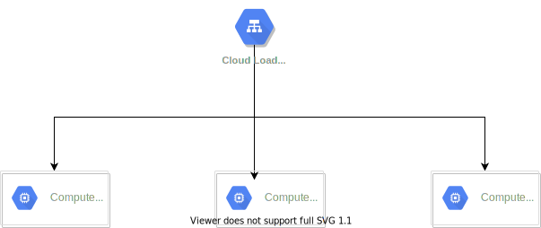

# Web Application - Apache Server - GCloud

_Get hands on Terraform tool_

## Goals:

Deploy apache server on 3 instances. Make it available with loadbalancer. Base on the workload we can scale out from 3 to 10 instances max.

## Main components:

- Global address for loadbalancer
- Auto scaler
- Backend service
- Instance template
- Instance group

## Test of the autoscaler

Install this tool for querying the app from gcloud shell.

`go get -u github.com/rakyll/hey`

Run this command to send 10 requests per second to the load balancer.

`hey -n 12000 -c 10 -q 1 http://<load-balancer-IP>`

Let this command keep sending requests for at least 5 minutes (maybe 10) and go back to VM instance screen.

To start:

`terraform apply`

To finish:

`terraform destroy`
